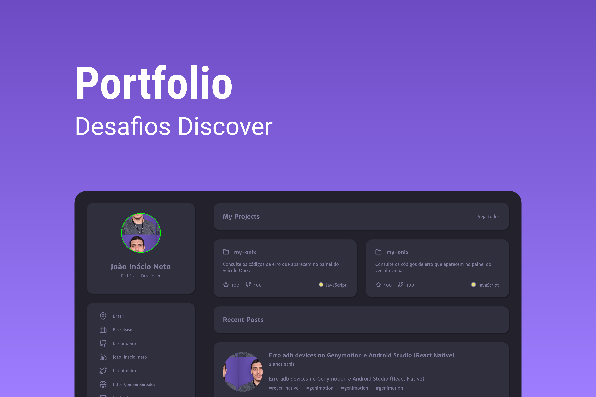
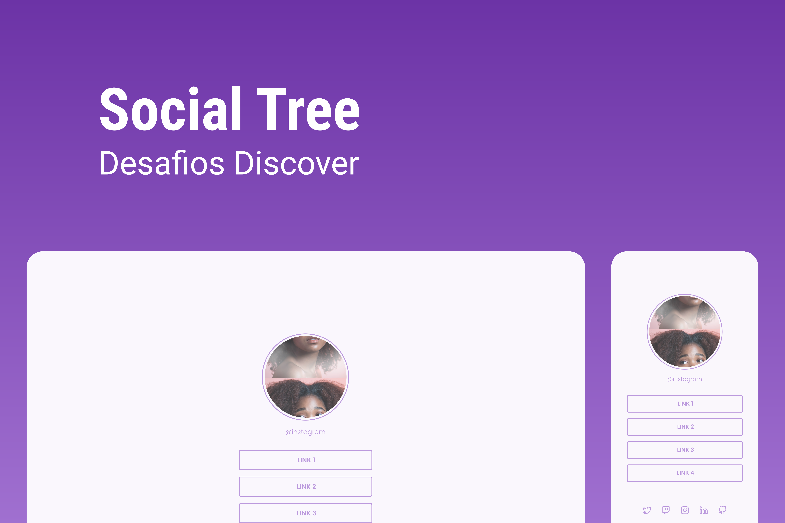
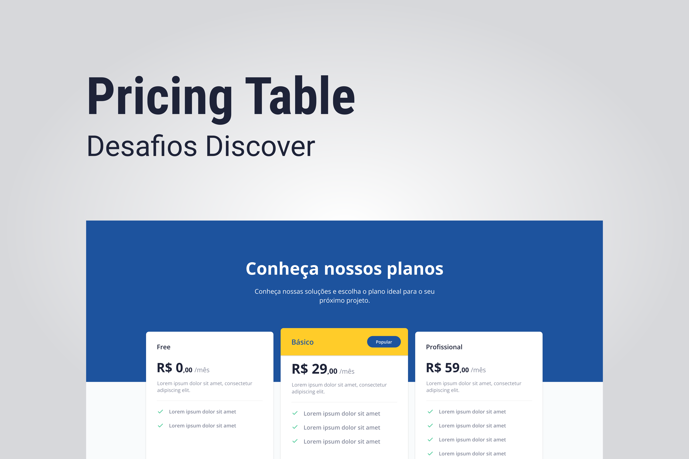
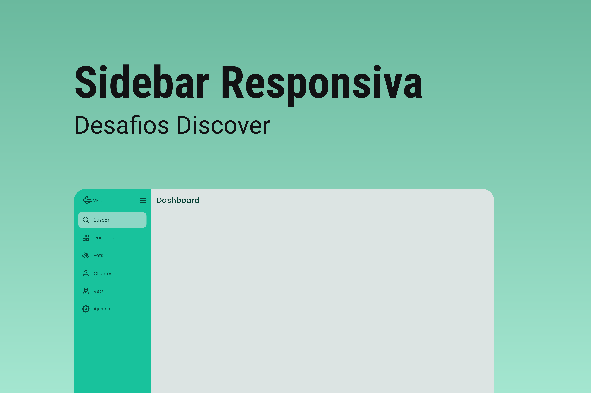
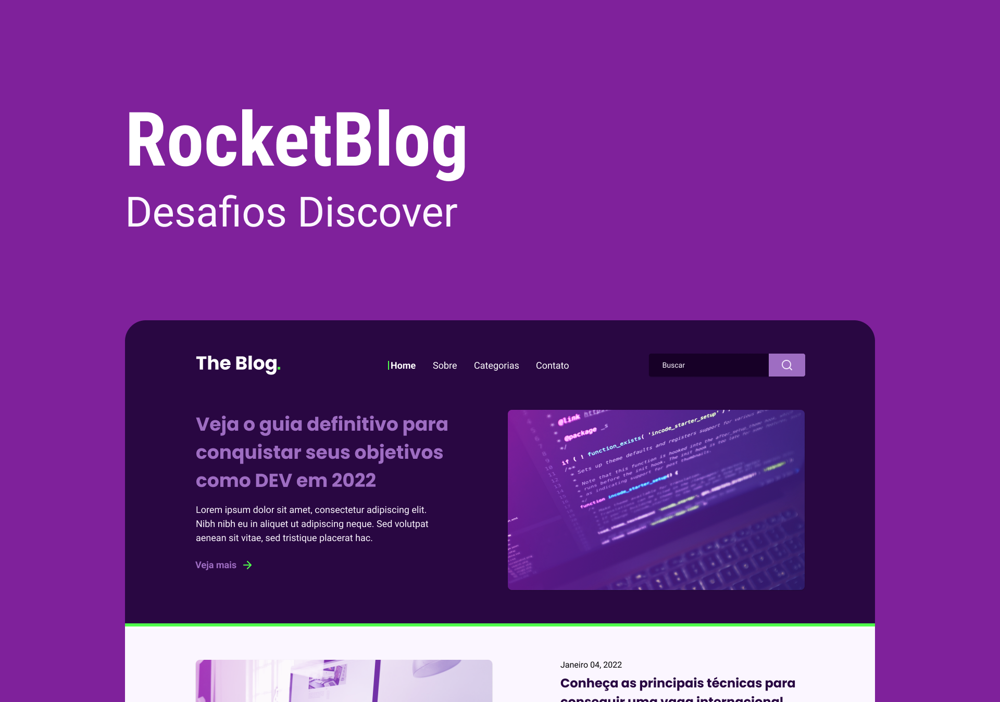
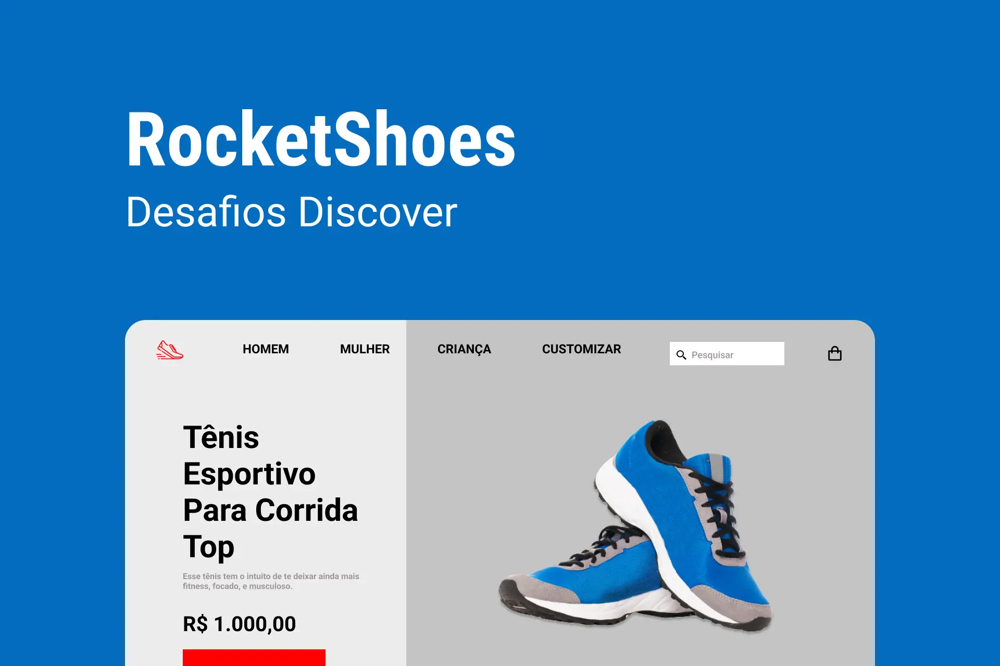
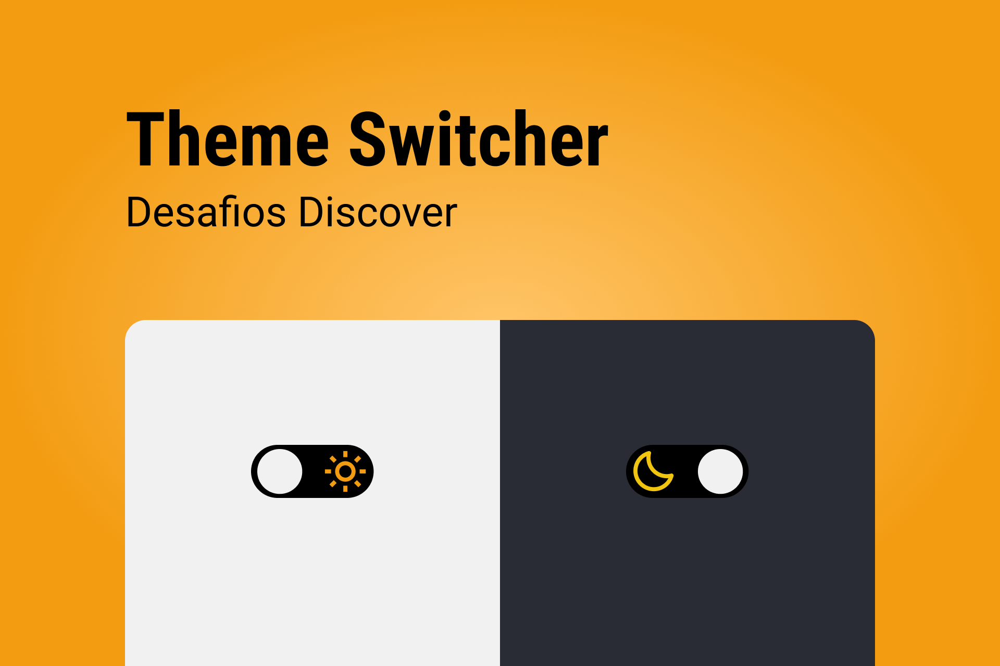
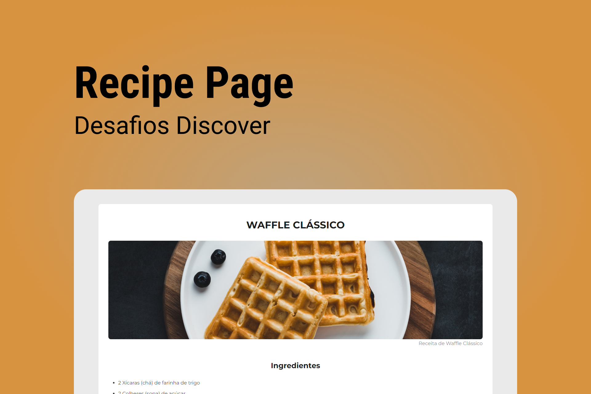

# Discover Challenges - Rocketseat

    

## 🚀 Tecnologias dos projetos
- HTML
- CSS
- JavaScript

## ⚙ Utilitários dos projetos
- [Google Fonts](https://fonts.google.com)
- [SwiperJS](https://swiperjs.com)
- [ScrollReveal](https://scrollrevealjs.org)
- [Unicons](https://iconscout.com/unicons)

## 💻 Repositório
O Discover Challenges é um repositório referente à todos os desafios propostos na plataforma da [Rocketseat](https://www.rocketseat.com.br) no segmento de estudos **Discover**.

## 📄 Página do Projeto
https://gustavo-nasc.github.io/Rocketseat-Discover-Challenges/

## 📜 Projetos Desenvolvidos
**Clique nas imagens para abrir cada projeto**
### Portfolio

    <a href="https://portfolio-gustavo-nascimento.herokuapp.com" target="_blank">
        
         
    </a>
    O Portflio é uma página referente à projetos e apresentação pessoal do DEV, implementado de acordo com os conhecimentos do DEV.

### Social Tree

    <a href="https://gustavo-nasc.github.io/Rocketseat-Discover-Challenges/projects/social-tree/social-tree.html" target="_blank">
        
         
    </a>
    O Social Tree ou Rocket Links é uma página referentes à links para as mídias sociais do DEV, onde são inseridas conforme a a quantidade que o mesmo deseja.

### Pricing Table

    <a href="https://gustavo-nasc.github.io/Rocketseat-Discover-Challenges/projects/pricing-table/pricing-table.html" target="_blank">
        
         
    </a>
    O Pricing Table é uma página com uma tabela com as opções de preços/planos do produto/serviço.

### Rocket News

    <a href="https://gustavo-nasc.github.io/Rocketseat-Discover-Challenges/projects/pricing-table/pricing-table.html" target="_blank">
        
         
    </a>
    O Rocket News é uma página para captação de leads e newsletter.

### Sidebar

    <a href="https://gustavo-nasc.github.io/Rocketseat-Discover-Challenges/projects/sidebar/sidebar.html" target="_blank">
        
         
    </a>
    A sidebar é uma menu lateral responsivo. Quando o usuário clicar no ícone do menu isso deve fazer com que o estado da sidebar mude entre "aberto" e "fechado".

### Rocket Blog

    <a href="https://gustavo-nasc.github.io/Rocketseat-Discover-Challenges/projects/rocket-blog/rocket-blog.html" target="_blank">
        
         
    </a>
    O Rocket Blog é uma SPA, uma homepage para um blog. Blog esse que possui artigos de Tecnologia da Informação.

### Rocket Shoes

    <a href="https://gustavo-nasc.github.io/Rocketseat-Discover-Challenges/projects/rocket-shoes/rocket-shoes.html" target="_blank">
        
         
    </a>
    O Rocket Shoes é um site de um mini e-commerce de calçados esportivos.

### Theme Switcher

    <a href="https://gustavo-nasc.github.io/Rocketseat-Discover-Challenges/projects/theme-switcher/theme-switcher.html" target="_blank">
        
         
    </a>
    O Theme Switcher é uma página que contém um toggle para alternar entre o tema dark e light.

### Recipe Page

    <a href="https://gustavo-nasc.github.io/Rocketseat-Discover-Challenges/projects/recipe-page/recipe-page.html" target="_blank">
        
         
    </a>
    A Recipe Page é uma página web de uma receita com título, imagem, lista de ingredientes e modo de preparo.

