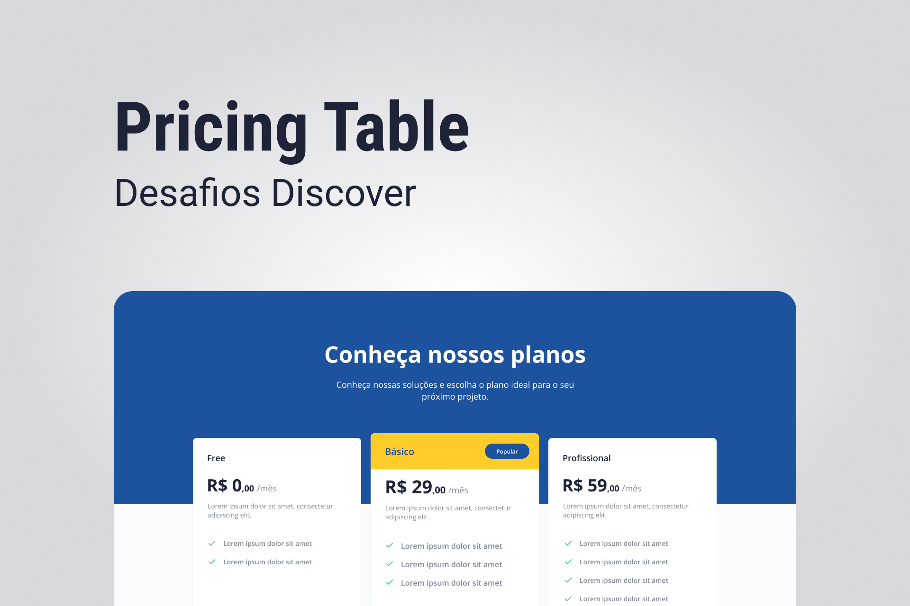

# Pricing Table - Rocketseat

    

## 🚀 Tecnologias
- HTML
- CSS
- JS

## ⚙ Utilitários
- [Google Fonts](https://fonts.google.com)
- [Unicons](https://iconscout.com/unicons)
- [SwiperJS](https://swiperjs.com)

## 💻 Projeto
O Rocket News é uma página para captação de leads e newsletter, uma proposta que está nos Desafios do Discover, da Rocketseat.

## 📄 Página do Projeto
https://gustavo-nasc.github.io/Rocket-News/

## 🔖 Layout
Você pode visualizar o layout do projeto através [desse link](https://www.figma.com/file/sSq019RDznSm3eyZoo3OHc/DD-Pricing-Table/duplicate). É necessário ter conta no [Figma](figma.com) para acessá-lo.

## 📚 Material Complementar
Acesse o material complementar do projeto por meio [desse link](https://efficient-sloth-d85.notion.site/Desafio-Pricing-Table-e0b6f59253e54d229fdde09228226b32#4d7637f8d8c846c2a48d4ecf73ac75da).