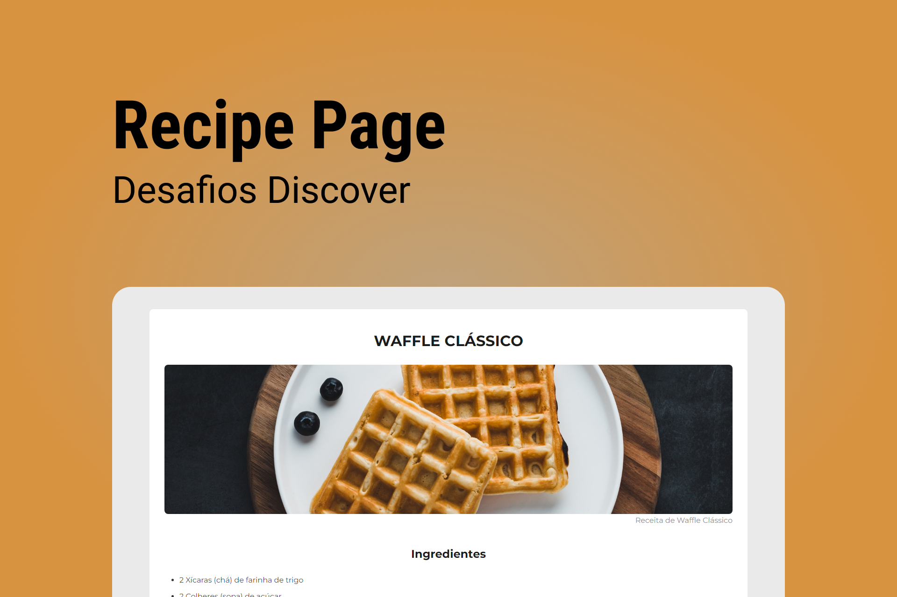

# Recipe Page

    

## 🚀 Tecnologias
- HTML
- CSS

## ⚙ Utilitários
- [Google Fonts](https://fonts.google.com)

## 💻 Projeto
A Recipe Page é uma página de receita com título, imagem, lista de ingredientes e modo de preparo.

## 📄 Página do Projeto
https://gustavo-nasc.github.io/Rocketseat-Discover-Challenges/projects/recipe-page/recipe-page.html

## 📚 Material Complementar
Acesse o material complementar do projeto por meio [desse link](https://efficient-sloth-d85.notion.site/Desafio-Piloto-P-gina-de-Receita-15acc6a34f744484a2e64a1f115bfbae).