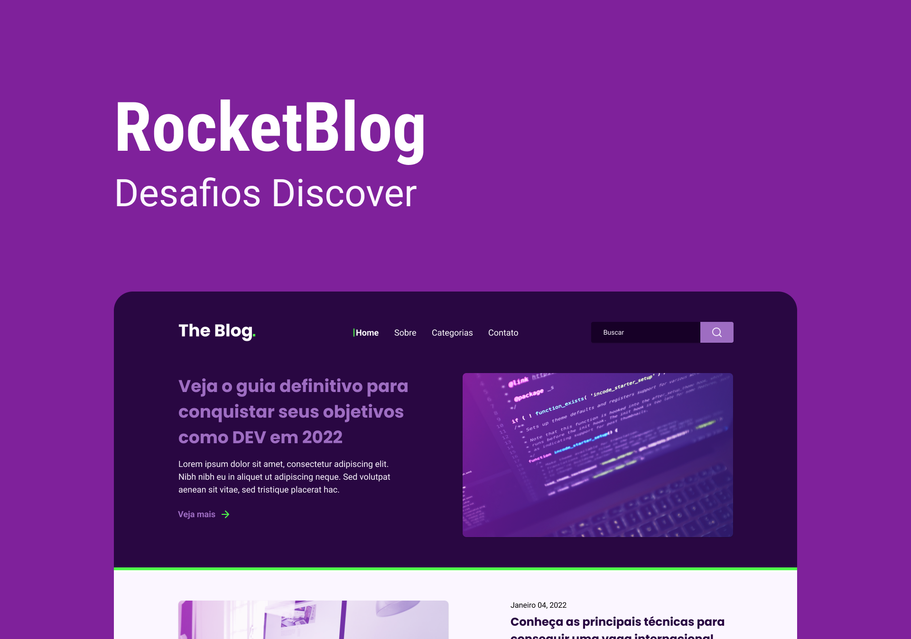

# Rocket Blog

    

## 🚀 Tecnologias
- HTML
- CSS
- JavaScript

## ⚙ Utilitários
- [Google Fonts](https://fonts.google.com)
- [ScrollReveal](https://scrollrevealjs.org)
- [Unicons](https://iconscout.com/unicons)

## 💻 Projeto
O Rocket Blog é uma SPA, uma homepage para um blog. Blog esse que possui artigos de Tecnologia da Informação.

## 📄 Página do Projeto
https://gustavo-nasc.github.io/Rocketseat-Discover-Challenges/projects/rocket-blog/rocket-blog.html

## 🔖 Layout
Você pode visualizar o layout do projeto através [desse link](https://www.figma.com/file/bC8GTiaCKZvLbGrOAiNH7v/DD-RocketBlog-Copy?fuid=1103741978465968790). É necessário ter conta no [Figma](figma.com) para acessá-lo.

## 📚 Material Complementar
Acesse o material complementar do projeto por meio [desse link](https://efficient-sloth-d85.notion.site/Desafio-RocketBlog-807e38809814423e80469b080444db5e).