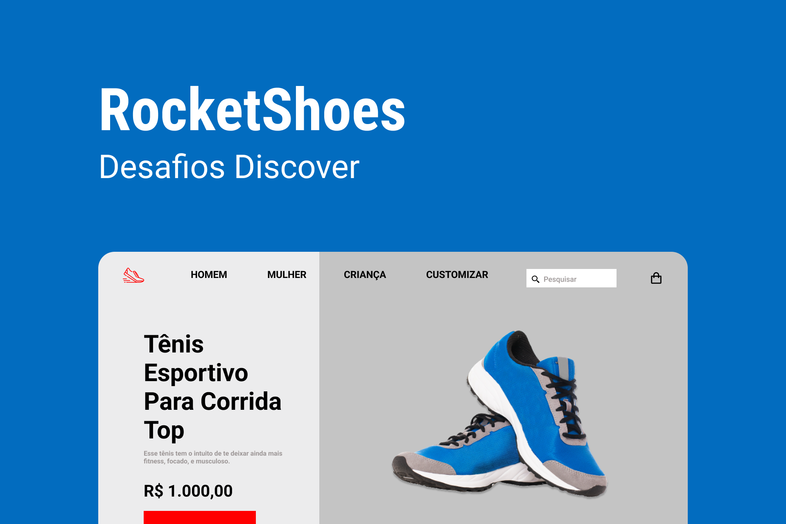

# Rocket News

    

## 🚀 Tecnologias
- HTML
- CSS
- JavaScript

## ⚙ Utilitários
- [Unicons](https://iconscout.com/unicons)
- [Google Fonts](https://fonts.google.com)

## 💻 Projeto
O Rocket News é uma página para captação de leads e newsletter.

## 📄 Página do Projeto
https://gustavo-nasc.github.io/Rocketseat-Discover-Challenges/projects/rocket-news/rocket-news.html

## 🔖 Layout
Você pode visualizar o layout do projeto através [desse link](https://www.figma.com/file/RT1tBEtoGu1RNMCErtwTm9/DD-RocketShoes-Copy?fuid=1103741978465968790). É necessário ter conta no [Figma](figma.com) para acessá-lo.

## 📚 Material Complementar
Acesse o material complementar do projeto por meio [desse link](https://efficient-sloth-d85.notion.site/Desafio-RocketShoes-c21f2886517b4424a45e13345953cef0).