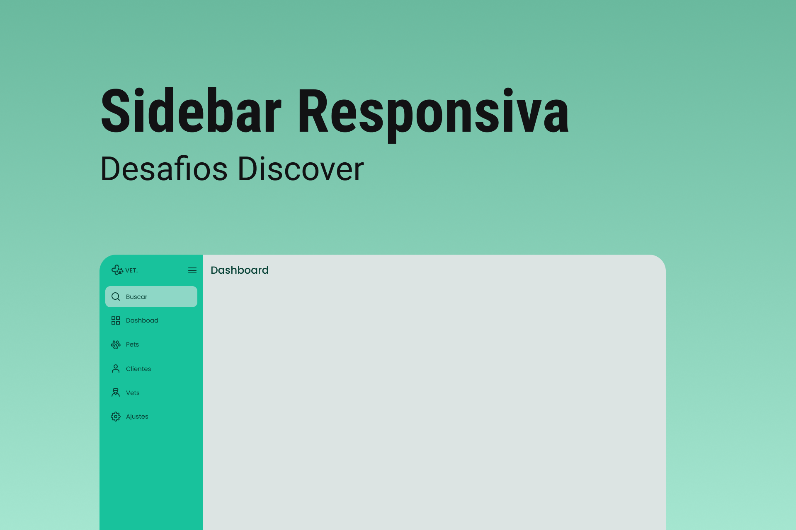

# Sidebar

    

## 🚀 Tecnologias
- HTML
- CSS
- JavaScript

## ⚙ Utilitários
- [Google Fonts](https://fonts.google.com)

## 💻 Projeto
A sidebar é uma menu lateral responsivo. Quando o usuário clicar no ícone do menu isso deve fazer com que o estado da sidebar mude entre "aberto", mostrando ícones e texto e "fechado", mostrando apenas os ícones.

## 📄 Página do Projeto
https://gustavo-nasc.github.io/Rocketseat-Discover-Challenges/projects/sidebar/sidebar.html

## 🔖 Layout
Você pode visualizar o layout do projeto através [desse link](https://www.figma.com/file/iOuqAlZvhAMkkfjCMFyc7Y/DD-%2F-Sidebar-Responsiva/duplicate). É necessário ter conta no [Figma](figma.com) para acessá-lo.

## 📚 Material Complementar
Acesse o material complementar do projeto por meio [desse link](https://efficient-sloth-d85.notion.site/Desafio-Sidebar-f2251eb4976941eb958326ea327ffeb9).