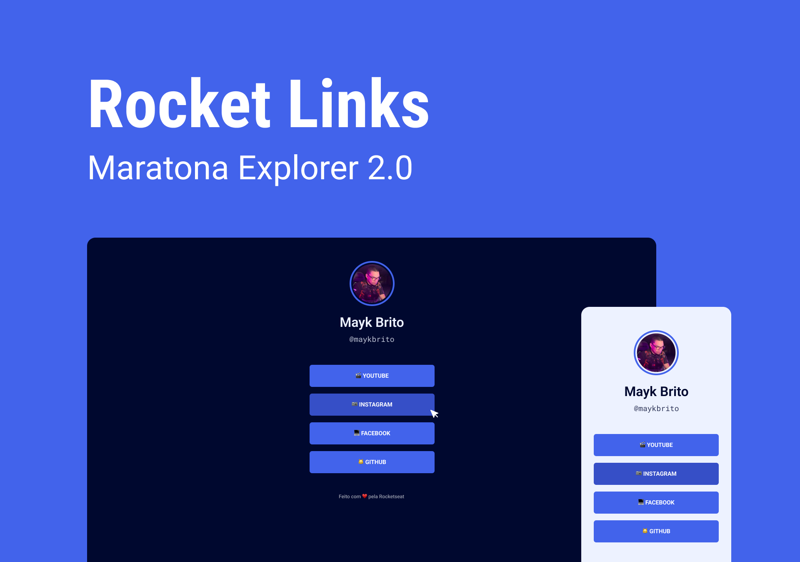
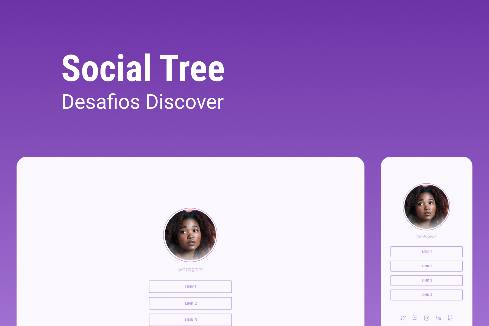

# Social Tree / Rocket Links

    
    

## 🚀 Tecnologias
- HTML
- CSS

## 💻 Projeto
O Social Tree ou Rocket Links é uma página referentes à links para as mídias sociais do DEV, onde são inseridas conforme a a quantidade que o mesmo deseja.

## 📄 Página do Projeto
https://gustavo-nasc.github.io/Rocketseat-Discover-Challenges/projects/social-tree/social-tree.html

## 🔖 Layout
Você pode visualizar o layout do projeto através [desse link](https://www.figma.com/file/pBYnQtYBG9iJ8GzbCwfPPP/DD-Social-links-Copy?fuid=1103741978465968790). É necessário ter conta no [Figma](figma.com) para acessá-lo.

## 📚 Material Complementar
Acesse o material complementar do projeto por meio [desse link](https://efficient-sloth-d85.notion.site/Maratona-Explorer-2-0-7ed52d87338e472e9fc7c25180ca933f), que é referente à Maratona Explorer #2 e [esse link](https://efficient-sloth-d85.notion.site/Desafio-Social-Tree-a4008e467a3248c4b05c97cf78aea44f), que é referente ao Desafio "Social Tree", proposto no Discover da [Rocketseat](https://www.rocketseat.com.br).