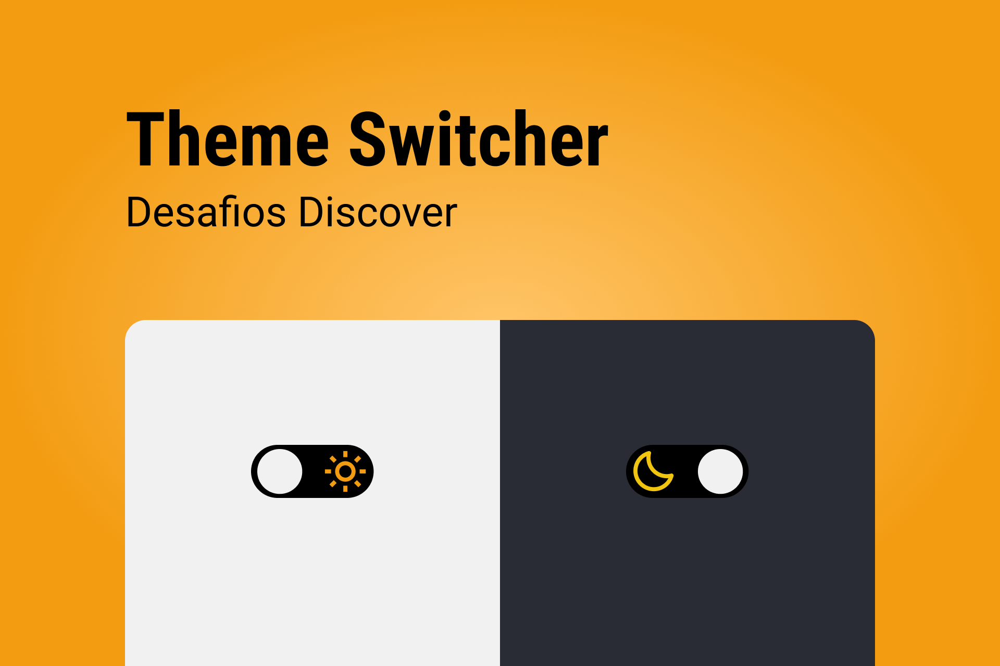

# Theme Switcher

    

## 🚀 Tecnologias
- HTML
- CSS
- JavaScript

## ⚙ Utilitários
- [Unicons](https://iconscout.com/unicons)

## 💻 Projeto
O Theme Switcher é uma página que contém um toggle para alternar entre o tema dark e light.

## 📄 Página do Projeto
https://gustavo-nasc.github.io/Rocketseat-Discover-Challenges/projects/theme-switcher/theme-switcher.html

## 🔖 Layout
Você pode visualizar o layout do projeto através [desse link](https://www.figma.com/file/asCxc2kKZMYd72TosJhzJh/DD-Theme-Switcher-Copy?fuid=1103741978465968790). É necessário ter conta no [Figma](figma.com) para acessá-lo.

## 📚 Material Complementar
Acesse o material complementar do projeto por meio [desse link](https://efficient-sloth-d85.notion.site/Desafio-Theme-Switcher-dbabdf77f70d43298df382c8e805fc13).

